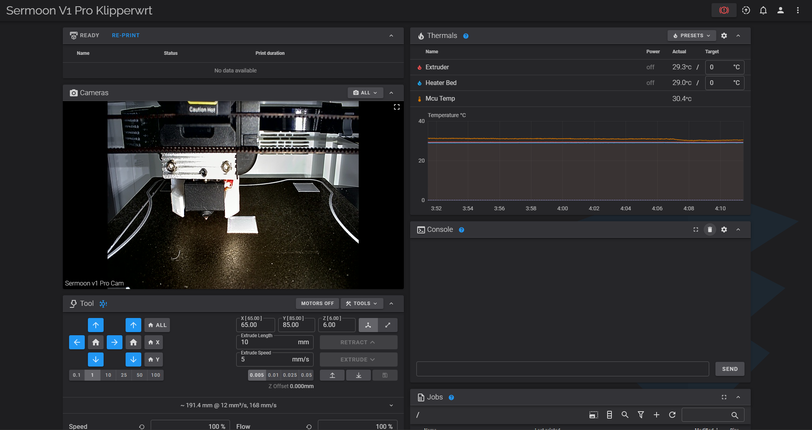

# <ins>Sermoon V1 Pro</ins>
 
<ins>Folder Firmware - Put in Sermoon v1/pro SD Card</ins>

<ins>Printer.cfg - Copy and paste in yor printer.cfg, I am use Fluidd </ins>

  ---------------------------------------------------------------------------------

  <details>
  <summary>Click me</summary>

## [controller_fan]
In out of box SermoonV1, controller fan always on. There is no way to set speed or turn off the fan.

In order to access the controller fan, the controller fan needs to be plugged in PB4, see figure below.
```cfg
[controller_fan controller_fan]
# In order to access the controller fan, the controller fan needs to be plugged
# in another location. See https://github.com/Klipper3d/klipper/pull/5621
# for more information.
pin: PB4
```


</details>

 ###   > https://discord.gg/wj9ETVGbgP


Discord invite have open and got few channels for now.
  ---------------------------------------------------------------------------------

### Klipperwrt: [Klipperwrt](https://github.com/ihrapsa/KlipperWrt)


   ---------------------------------------------------------------------------------

```mjpg_streamer --input input_unc.so --device/video2 --fps 30 --yuv --quality 100 --resolution 1280x720 --led off --output output_http.so --port 8080 --www /www/webcam/```


   ---------------------------------------------------------------------------------

   url stream: /webcam/?action=stream
   
   url snapshot: /webcam/?action=snapshot
